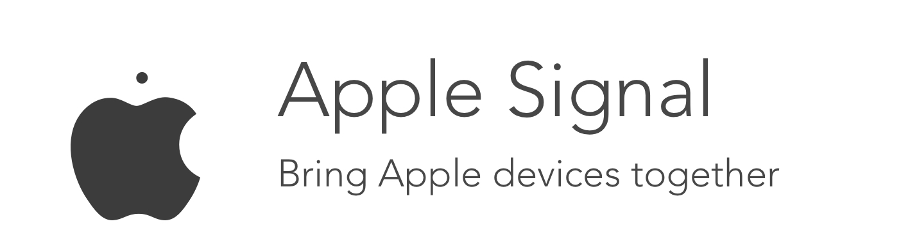

 
# Apple Signal 


A library that allows for local connections between Apple devices. It will automatically use either bluetooth or wifi to connect multiple devices and share information. Currently supports iOS and macOS.

## Demo

**iOS UI Demo**


**iOS Auto Connect Demo**


**Mac Demo**


## Installation

Grab the source folder and drag it into your project! If you are making a macOS app, you can remove the InviteTableViewController.swift and Signal.storyboard files.


## Example

Signal is really easy to setup. Just start the connection, and you can begin sending and receiving data! **This is a very basic overview. Check out the Complete Guide and Xcode demo project for the full capabilities.**

Start the connection. There are multiple connection modes you can choose from.

```swift
Signal.instance.autoConnect()
```

In Signal, you can add a tag to the data you send so that the receiver knows what the data is. You can create a `UInt32` enum to manage these tags. Here's an example:

```swift
enum DataType: UInt32 {
    case string = 100
    case image = 101
}
```

Send some text, and specify its type using a `UInt32` enum. This way you can inform the recipient about which type of data is being sent.

```swift
Signal.instance.sendObject(object: "Hello World!", type: DataType.string.rawValue)
```

The protocol conformation. We get the data, check its type, convert it back to the according object (in this case, a string) using a handy data extension method, and update our UI. You can also update the list of connected devices with the second method.

```swift
func signal(didReceiveData data: Data, ofType type: UInt32) {
    if type == DataType.string.rawValue {
        let string = data.convert() as! String
        self.textLabel.text = string
    }
}

func signal(connectedDevicesChanged devices: [String]) {}
```

And we just setup a session where people can connect and send texts to each other. It's that simple!

## Complete Guide

Signal uses the Multipeer Connectivity library by Apple, and simplifies the process. The process of making a session is overcomplicated, and their library of UI elements used to host/invite other devices is often slow or does not work at all. So, this library helps fix that with a much simpler session process along with custom UI elements.

### Methods and Properties

  This library has support on both iOS and macOS, but the UI elements have not yet been implemented on the macOS version. Thus, **the `inviteUI()` and `acceptUI` are currently only available on the iOS version.**

**Setup**

`initialize(serviceType: String)` - Specify a name for the signal.
**Limited to one hyphen (-) and 15 characters.**
**Devices can only see each other if they have the same service name.** This means that you can use a static string to allow all devices see each other, or you can also add in password functionality by making the user input a custom service name. If you ever want to change this, just run this method again.

`initialize(serviceType: String, deviceName: String)` - Specify a service type, but also use a custom name. If you don't use this method, the default device name will be used.

**Connect**

`autoConnect()` - The easiest and fastest way to connect. Automatically connects all devices also running this method (on the same service type) together.

`inviteAuto()` - Automatically invites all detected devices, and continues to look for more until stopped

`inviteUI() -> UIViewController, iOS Only` - This method returns a custom View Controller that you should present so that the user can see a list of available devices, and invite them by tapping on them. This view can be fully customized by editing the Signal.storyboard source file or the `InviteTableViewController` class in the source.

`acceptAuto()` - Automatically accepts any invites received until stopped

`acceptUI(), iOS Only` - In the protocol method, `receivedInvitation`, you will be given a `UIAlertController` that you can present. The user can then accept or decline the invitation.

**Stop Services**

`stopInviting()` and `stopAccepting()` - Stops the invitation or accept services

`stopSearching()` - Stops both inviting and accept services

`disconnect()` - Disconnects the user from the connected session

`shutDown()` - Shuts down all signal services. Stops searching and disconnects.

**Data**

`sendData(object: Any)` - Pass in any object to be sent to all other connected devices. It works by converting it to Data with the NSKeyedArchiver and then sending it. If you want to send multiple objects, the best way would be to use a single container class.

`sendData(data: Data, type: UInt32)` - Send data to all connected devices with a tag so that the receiver knows what type of data it is. An enum should be used to declare different types.

`convert(), Data class extension` - This is a method that can be used to convert data that you have received from another device back into a useful object. It will return type `Any`, but you can cast it into the right class.

`connectionTimeout, default is 10` - The time (in seconds) a device can spend attempting to connect before quitting.


### Protocol
You conform to the `SignalDelegate` protocol. There are 3 methods that provide you with useful information. These methods run in the background, so **make sure that you use the main thread for any UI changes.**

`ignal(didReceiveData data: Data, ofType type: UInt32)` - This runs whenever data has received. You can use the type to check and convert the data back into its corresponding object.

`deviceConnectionsChanged(connectedDevices: [String])` - Runs whenever a device has connected/disconnected. It gives you the new list of connected device names.

## Coming Soon

This project is currently at minimum functionality. It currently can just connect all users with the same service name, and send data between them. Soon, the following features will be added.

- [x] Quick auto connect
- [x] Simple data communication
- [x] iOS UI elements
- [ ] macOS UI elements
- [ ] Simple streaming